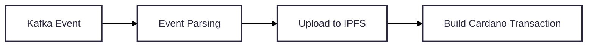

# reeve-ipfs-publisher

> ⚠️ **This is a demo project and a work in progress. It is not production-ready and is intended for exploration and prototyping purposes only.**

## Overview

`reeve-ipfs-publisher` is a Spring Boot service that acts as a bridge between business transaction data, IPFS, and the Cardano blockchain. It receives financial transaction payloads (e.g. invoices with line items, VAT, cost centers), stores them on IPFS, and anchors the resulting IPFS content identifier (CID) on-chain as Cardano transaction metadata.

## How It Works

1. **Ingest** – A Kafka consumer listens on the configured topic (`reeve.ipfs.topic`) for incoming `PublishMessageRequest` messages.
2. **Store on IPFS** – The payload is serialised to JSON and pinned to an IPFS node. The resulting CID (Base58) is returned.
3. **Anchor on Cardano** – A Cardano transaction is built and submitted (via Blockfrost) that carries the IPFS CID together with organisation metadata under the metadata label `1447`.



> **Note on the REST API:** The `POST /api/v1/publish` endpoint is included purely as a **demo convenience**. It simply forwards the request body onto the Kafka topic, making it easy to trigger the full flow without a real Kafka producer. In the intended target architecture, messages will arrive exclusively via Kafka and the REST endpoint will not be present.

## Tech Stack

| Component  | Technology                                                                         |
|------------|------------------------------------------------------------------------------------|
| Language   | Java 21                                                                            |
| Framework  | Spring Boot 3.x                                                                    |
| Messaging  | Apache Kafka                                                                       |
| Blockchain | Cardano (via [cardano-client-lib](https://github.com/bloxbean/cardano-client-lib)) |
| Storage    | IPFS (via [java-ipfs-http-client](https://github.com/ipfs/java-ipfs-http-client))  |
| API Docs   | SpringDoc OpenAPI (Swagger UI)                                                     |

## Local Infrastructure

A `docker-compose.yml` is provided to spin up all required dependencies:

| Service       | Description                              | Default Port |
|---------------|------------------------------------------|--------------|
| `kafka`       | Apache Kafka (KRaft mode)                | `9092`       |
| `kafdrop`     | Kafka UI                                 | `19000`      |
| `yaci-cli`    | Local Cardano devnet node + Blockfrost-compatible API | `8080` |
| `yaci-viewer` | Cardano devnet block explorer            | `5173`       |
| `postgres`    | PostgreSQL (used by yaci)                | `5432`       |

Start all services:

```bash
docker compose up -d
```

## Configuration

Key configuration properties in `application.yaml` (can be overridden via environment variables):

| Property | Env Variable | Default |
|----------|-------------|---------|
| Server port | `SERVER_PORT` | `9000` |
| Kafka bootstrap servers | – | `localhost:9092` |
| IPFS node address | – | `/ip4/192.168.1.2/tcp/5002` |
| Blockfrost URL | `BLOCKFROST_URL` | `http://localhost:8080/api/v1/` |
| Blockfrost project ID | `BLOCKFROST_KEY` | `Dummy Key` |
| Cardano network | `NETWORK` | `testnet` |
| Wallet mnemonic | `MNEMONIC` | test mnemonic |
| Organisation ID | `ORGANISATION_ID` | `123456789` |

## Running the Application

```bash
./gradlew bootRun
```

The Swagger UI is available at [http://localhost:9000/swagger-ui.html](http://localhost:9000/swagger-ui.html).

## API

> ⚠️ The REST API exists solely to **simulate a Kafka message** for demo and testing purposes. It is not part of the final architecture.

### `POST /api/v1/publish` *(demo only)*

Sends a transaction payload to the Kafka topic, which then triggers the IPFS storage and Cardano anchoring flow.

**Request body example:**
```json
{
  "transaction": [
    {
      "id": "...",
      "items": [...],
      "vat": {...},
      "costCenter": {...}
    }
  ]
}
```

## Limitations & Known Issues

- The IPFS node address is currently hardcoded in the default configuration.
- Error handling and retry logic are minimal.
- No authentication or authorisation on the REST API.
- Test coverage is not yet implemented.
- The wallet mnemonic defaults to a well-known test phrase — **never use a real mnemonic in this configuration**.


